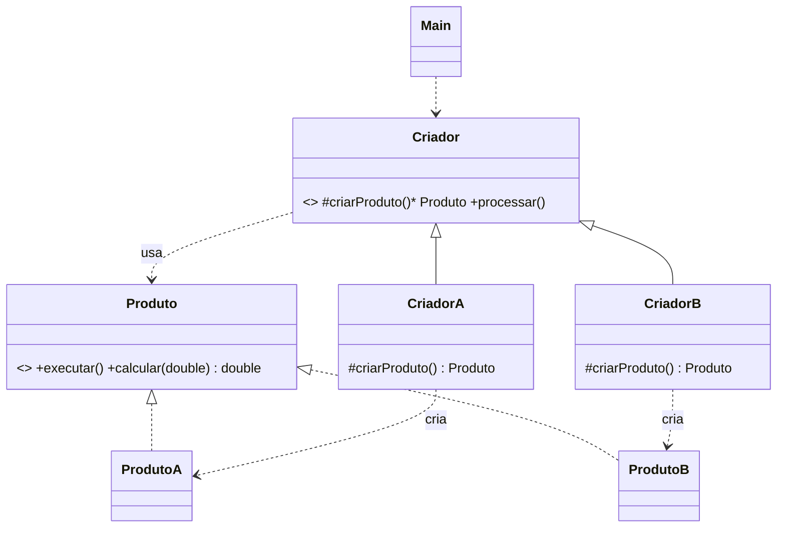
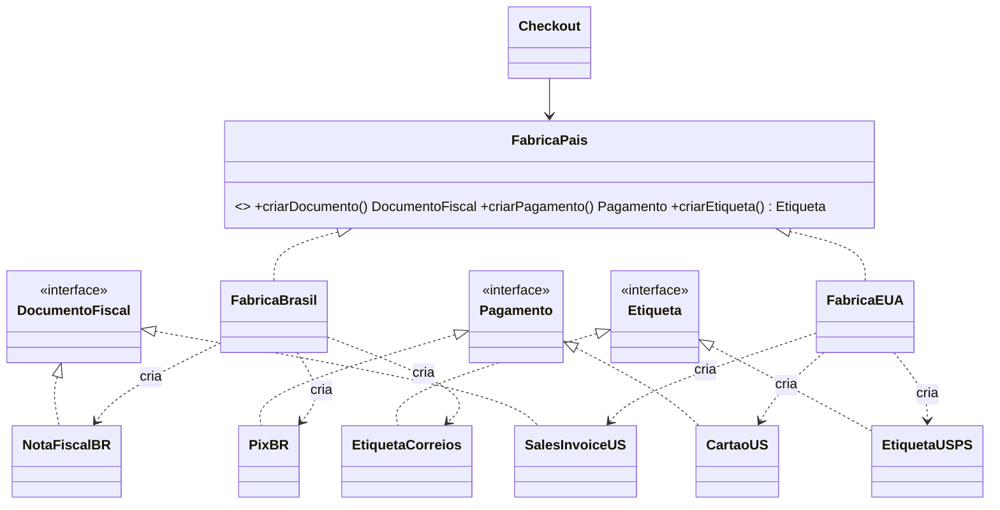

# Cola: Prova 1º Bimestre (Design Patterns, Java)

> Abra no VS Code com `Ctrl+Shift+V` (preview). Referências de código pronto: [factoryMethod/](factoryMethod/), [factoryMethodV2/](factoryMethodV2/), [factoryMethoudV3/](factoryMethoudV3/).

---

## 0. Assim que sentar

1. `Ctrl+Shift+P` → **Java: Create Java Project** → **No build tools** → escolha a pasta → nome do projeto.
2. O código fica em `src/`. Pode usar **sem package** (mais simples) ou criar `src/prova/` com `package prova;` em todo arquivo.
3. Rode pelo ▶ **Run** acima do `main`. Se o IntelliSense não ligar: `Ctrl+Shift+P` → **Java: Clean Java Language Server Workspace**.
4. **Faça commit cedo e várias vezes** (seção 11). A entrega é **só pelo Git**.

---

## 1. Qual padrão? (pistas no enunciado)

| Se o enunciado diz... | Padrão |
|---|---|
| "hoje é resolvido com **if/switch que cresce** a cada produto novo" | trocar por polimorfismo (FM ou AF) |
| "novo tipo **sem alterar nenhuma classe existente**, só adicionando classes" | Aberto/Fechado → **Factory Method** ou **Abstract Factory** |
| "o **processo é sempre o mesmo**, só muda **o tipo** do objeto criado" | **Factory Method** |
| "**método fábrica**", "**subclasses decidem** qual classe instanciar", "classe abstrata de **criador**" | **Factory Method** |
| "**vários objetos** (ex.: documento + pagamento + etiqueta) que **precisam ser da mesma família / país / tema**", "não podem ser **misturados**" | **Abstract Factory** |
| "o nome do padrão não foi informado, **identifique**" | quase sempre AF se tem *família de objetos*; FM se tem *um objeto* |
| "adicionar responsabilidades **dinamicamente**", "combinações" (café + leite + açúcar) | **Decorator** |
| "quando X **muda de estado**, **todos os interessados** são avisados" | **Observer** |

**Factory Method × Abstract Factory, em uma linha:**
- **FM** = 1 produto, usa **herança** (`Criador` abstrato com `criarProduto()`, subclasses sobrescrevem).
- **AF** = **família** de produtos, usa **composição** (interface `Fabrica` com `criarA()`, `criarB()`, `criarC()`; uma fábrica concreta por família).

---

## 2. Roteiro para qualquer enunciado (10 min no papel antes de codar)

1. **Sublinhe os substantivos que variam** (Auto, Vida, Viagem / Brasil, EUA, Alemanha) → viram **produtos concretos**.
2. **O que é comum a todos?** → vira a **interface/classe abstrata do produto** (métodos: calcular, validar, documentos, resumo...).
3. **Qual é o fluxo fixo?** ("validar → calcular → emitir → imprimir") → vira o **método concreto (final) do Criador**.
4. Para cada pergunta, responda: **"isso muda de um tipo para outro?"**
   - Muda → método **abstrato** no produto, implementado em cada concreto.
   - Não muda → método **concreto** no Creator/classe base.
5. Cada **RF** vira uma classe concreta. Cada **RNF** vira uma regra de estrutura (ex.: "número prefixado" → contador `static` + prefixo).
6. Leia os **Critérios de avaliação** e transforme em checklist (seção 10).

---

## 3. Factory Method: esqueleto

```
Produto (interface ou abstract)  ← ProdutoA, ProdutoB, ProdutoC
Criador (abstract)               ← CriadorA, CriadorB, CriadorC
   - criarProduto()  abstrato   (MÉTODO FÁBRICA)
   - processar()     final      (fluxo comum, só usa Produto)
Cliente (Main)  → usa Criador, NUNCA faz new ProdutoX()
```

### 3.1 Produto como interface (igual aos meus exercícios)

```java
public interface Produto {
    void executar();
    double calcular(double valor);
}

public class ProdutoA implements Produto {
    @Override
    public void executar() { System.out.println("Executando A"); }

    @Override
    public double calcular(double valor) { return valor * 1.05; }
}
```

### 3.2 Produto como classe abstrata (quando o enunciado pede "classe abstrata de produto" ou tem atributos/código comum)

```java
import java.time.LocalDate;
import java.util.List;

public abstract class Produto {
    private static int contador = 0;             // número único (RNF "prefixado")
    protected final String numero;
    protected final String cliente;
    protected final LocalDate dataEmissao;

    protected Produto(String prefixo, String cliente) {
        contador++;
        this.numero = prefixo + String.format("%04d", contador);   // ex.: AUTO-0001
        this.cliente = cliente;
        this.dataEmissao = LocalDate.now();
    }

    // o que MUDA por tipo → abstrato
    public abstract double calcularValor();
    public abstract boolean validar();
    public abstract List<String> documentos();

    // o que NÃO muda → concreto, na base
    public String gerarResumo() {
        return String.format("Nº %s | Cliente: %s | Emissão: %s | Valor: R$ %.2f | Docs: %s",
                numero, cliente, dataEmissao, calcularValor(), documentos());
    }
}
```

```java
import java.util.List;

public class ProdutoA extends Produto {
    private final double base;
    private final int idade;

    public ProdutoA(String cliente, double base, int idade) {
        super("A-", cliente);          // chama o construtor da classe mãe
        this.base = base;
        this.idade = idade;
    }

    @Override
    public double calcularValor() {
        double anual = base * 0.08;
        if (idade < 25) anual *= 1.30;         // regra de negócio: pode ter if AQUI (dentro do produto)
        return anual / 12;                     // mensal
    }

    @Override
    public boolean validar() { return base >= 50000; }

    @Override
    public List<String> documentos() { return List.of("CNH", "CRLV", "Comprovante de residência"); }
}
```

> Acréscimos em cadeia: `+30%` e depois `+20%` = `valor * 1.30 * 1.20`. Documento "quando aplicável": monte com `new ArrayList<>(List.of(...))` e dê `add(...)` dentro de um `if`.

### 3.3 Criador

```java
public abstract class Criador {

    protected abstract Produto criarProduto();          // MÉTODO FÁBRICA (sem new aqui!)

    public final void processar() {                     // final = subclasse não pode mudar o fluxo
        Produto p = criarProduto();
        if (!p.validar()) {                             // if de VALIDAÇÃO pode; if de TIPO não
            System.out.println("Contratação REJEITADA");
            return;
        }
        System.out.println(p.gerarResumo());
    }
}
```

```java
public class CriadorA extends Criador {
    private final String cliente;
    private final double base;
    private final int idade;

    public CriadorA(String cliente, double base, int idade) {   // os dados entram pelo construtor
        this.cliente = cliente;
        this.base = base;
        this.idade = idade;
    }

    @Override
    protected Produto criarProduto() {
        return new ProdutoA(cliente, base, idade);   // ÚNICO lugar com new ProdutoA
    }
}
```

> Rejeição com exceção (alternativa ao `boolean`): no produto, `throw new IllegalArgumentException("Cobertura mínima R$ 50.000");` e no `processar()` use `try { ... } catch (IllegalArgumentException e) { System.out.println("REJEITADO: " + e.getMessage()); }`.

### 3.4 Cliente

```java
public class Main {
    public static void main(String[] args) {
        Criador c1 = new CriadorA("Ana", 80000, 22);      // variável do tipo ABSTRATO
        c1.processar();

        Criador c2 = new CriadorB("Bruno", 300000);
        c2.processar();
    }
}
```

**Cliente que "escolhe pelo tipo" sem if/switch** (critério "sem condicionais no cliente"):

```java
import java.util.HashMap;
import java.util.Map;

Map<String, Criador> criadores = new HashMap<>();
criadores.put("AUTO", new CriadorA("Ana", 80000, 22));
criadores.put("VIDA", new CriadorB("Bruno", 300000));

String tipo = "AUTO";
criadores.get(tipo).processar();      // nova linha de produto = só mais um put()
```

---

## 4. Abstract Factory: esqueleto

```
ProdutoA (interface) ← ProdutoA_BR, ProdutoA_US
ProdutoB (interface) ← ProdutoB_BR, ProdutoB_US
ProdutoC (interface) ← ProdutoC_BR, ProdutoC_US
Fabrica (interface): criarA(), criarB(), criarC()
   ← FabricaBR (cria só coisas _BR), FabricaUS (cria só coisas _US)
Servico/Checkout: recebe UMA Fabrica no construtor → impossível misturar famílias
```

```java
// Produtos abstratos (uma interface por "tipo de coisa")
public interface DocumentoFiscal { String emitir(double valor); }
public interface Pagamento       { String processar(double valor); }
public interface Etiqueta        { String gerar(String endereco); }

// Fábrica abstrata: cria a FAMÍLIA inteira
public interface FabricaPais {
    DocumentoFiscal criarDocumento();
    Pagamento criarPagamento();
    Etiqueta criarEtiqueta();
}
```

```java
// Uma família concreta
public class FabricaBrasil implements FabricaPais {
    @Override public DocumentoFiscal criarDocumento() { return new NotaFiscalBR(); }
    @Override public Pagamento criarPagamento()       { return new PixBR(); }
    @Override public Etiqueta criarEtiqueta()         { return new EtiquetaCorreios(); }
}

public class NotaFiscalBR implements DocumentoFiscal {
    @Override
    public String emitir(double valor) {
        double icms = valor * 0.18;
        return String.format("NF-e | CFOP 5.102 | ICMS R$ %.2f", icms);
    }
}
```

```java
// Cliente do padrão: depende SÓ de abstrações, sem if de país
public class Checkout {
    private final FabricaPais fabrica;

    public Checkout(FabricaPais fabrica) { this.fabrica = fabrica; }

    public void finalizar(double valor, String endereco) {
        DocumentoFiscal doc = fabrica.criarDocumento();
        Pagamento pag = fabrica.criarPagamento();
        Etiqueta etq = fabrica.criarEtiqueta();

        System.out.println("===== RELATÓRIO DO PEDIDO =====");   // formato padronizado (RNF)
        System.out.println("Documento: " + doc.emitir(valor));
        System.out.println("Pagamento: " + pag.processar(valor));
        System.out.println("Envio....: " + etq.gerar(endereco));
    }
}

// Main
new Checkout(new FabricaBrasil()).finalizar(100.0, "80000-000");
new Checkout(new FabricaEUA()).finalizar(100.0, "90210-1234");
```

**Novo país** = 1 fábrica + 1 classe por produto. **Zero** classes existentes alteradas.

Regras que variam *dentro* do país (ex.: ICMS 18% ou 12% interestadual, sales tax por estado) ficam **dentro da classe concreta** do produto, podem ter `if` ou `Map<String, Double>` ali. O que não pode é `if (pais == ...)` no Checkout.

---

## 5. Onde pode e onde NÃO pode ter `if`

| Lugar | `if`/`switch` decidindo o **tipo** | `if` de **regra de negócio** |
|---|---|---|
| Cliente (`Main`) | ❌ (use `Map` ou chame direto) | ok |
| Criador abstrato / Checkout | ❌ | ✅ validação (`valor <= 0`, rejeição) |
| Produto concreto | não faz sentido | ✅ (idade < 25, fumante, internacional) |

---

## 6. UML: notação e modelo

| Símbolo | Significado | Mermaid |
|---|---|---|
| linha cheia + triângulo vazio | herança (`extends`) | `Mae <\|-- Filha` |
| tracejada + triângulo vazio | implementa (`implements`) | `Interface <\|.. Classe` |
| tracejada + seta aberta | dependência (usa/cria) | `A ..> B : cria` |
| linha cheia + seta | associação (tem atributo) | `Checkout --> FabricaPais` |
| `+` `-` `#` | public / private / protected | `+metodo()` `#criar()` |
| *itálico* ou `*` | abstrato | `#criarProduto()* Produto` |
| `<<interface>>` / `<<abstract>>` | estereótipo | dentro da classe |

**Modelo Factory Method** (cole num `README.md` da entrega, o GitHub desenha):

````

````

**Modelo Abstract Factory:**

````

````

> Se o diagrama tiver que ser à mão/em outra ferramenta: **o diagrama tem que bater com o código** (é critério de avaliação). Mesmos nomes de classe e método.

---

## 7. SOLID em uma linha cada

| | Princípio | Como aparece nos padrões |
|---|---|---|
| **S** | Responsabilidade única: uma classe, um motivo para mudar | cálculo de desconto IR/ISS fora de `Funcionario`; produto calcula, criador orquestra |
| **O** | Aberto p/ extensão, fechado p/ modificação | novo tipo = **classes novas**, nada editado |
| **L** | Substituição de Liskov: subclasse no lugar da base sem quebrar | qualquer `Criador` funciona no `Main` |
| **I** | Segregação de interface: interfaces pequenas e específicas | `Pagamento`, `Etiqueta` separadas, não uma interface gigante |
| **D** | Inversão de dependência: dependa de abstrações | `Checkout` recebe `FabricaPais`, não `FabricaBrasil` |

---

## 8. Java OO básico (herança, polimorfismo, abstract, interface)

```java
public abstract class Funcionario {
    protected double salario;
    public Funcionario(double salario) { this.salario = salario; }
    public abstract double getBonificacao();          // cada subclasse calcula do seu jeito
}

public class Gerente extends Funcionario {
    public Gerente(double salario) { super(salario); }
    @Override
    public double getBonificacao() { return salario * 0.10 + 500; }
}

public class Diretor extends Funcionario {
    private int subordinados;
    public Diretor(double salario, int subordinados) { super(salario); this.subordinados = subordinados; }
    @Override
    public double getBonificacao() { return salario * 0.015 * subordinados; }
}

// Polimorfismo: recebe a BASE, funciona com qualquer filha
public class Financeiro {
    private double total = 0;
    public void registra(Funcionario f) { total += f.getBonificacao(); }
    public double getTotal() { return total; }
}
```

Reaproveitar a lógica da mãe e somar algo: `return super.getBonificacao() + 1000;` (só se o método da mãe **não** for abstrato).

| | `abstract class` | `interface` |
|---|---|---|
| Pode ter atributos com estado | ✅ | ❌ (só constantes) |
| Pode ter construtor | ✅ | ❌ |
| Métodos com corpo | ✅ | só `default`/`static` |
| Herança | só **1** (`extends`) | **várias** (`implements A, B`) |
| Instanciar com `new` | ❌ | ❌ |
| Use quando | tem código/atributos comuns | só contrato |

Palavras-chave que caem:
- `final` no método → subclasse **não** sobrescreve (use no fluxo do Creator).
- `protected` → visível na subclasse (use no método fábrica).
- `static` → pertence à classe, compartilhado (contador de número único).
- Métodos de interface são `public` → a implementação **tem que** ser `public`.

---

## 9. Caso caia Observer ou Decorator

**Observer** (1 → muitos, avisa quando muda):

```java
public interface Observador { void atualizar(int estado); }

public class Sujeito {
    private final List<Observador> observadores = new ArrayList<>();
    private int estado;
    public void anexar(Observador o) { observadores.add(o); }
    public void setEstado(int estado) {
        this.estado = estado;
        for (Observador o : observadores) o.atualizar(estado);   // notifica todos
    }
}

public class ObservadorConcreto implements Observador {
    @Override public void atualizar(int estado) { System.out.println("Novo estado: " + estado); }
}
```

**Decorator** (embrulha o objeto e soma comportamento):

```java
public interface Bebida { String descricao(); double preco(); }

public class Cafe implements Bebida {
    public String descricao() { return "Café"; }
    public double preco() { return 3.0; }
}

public abstract class Adicional implements Bebida {       // decorador abstrato
    protected final Bebida bebida;
    public Adicional(Bebida bebida) { this.bebida = bebida; }
}

public class Leite extends Adicional {
    public Leite(Bebida b) { super(b); }
    public String descricao() { return bebida.descricao() + ", leite"; }
    public double preco() { return bebida.preco() + 0.5; }
}

// Bebida b = new Leite(new Acucar(new Cafe()));
```

---

## 10. Checklist antes de entregar (critérios que o prof usa)

- [ ] `Main` **não tem** `new ProdutoConcreto()`. Só cria **Criadores** (FM) ou **Fábricas** (AF).
- [ ] Criador abstrato **não tem `new`** de produto e **não tem `if` de tipo**.
- [ ] Método fábrica é `protected abstract` no Criador; fluxo é `public final`.
- [ ] Variáveis declaradas com o **tipo abstrato** (`Criador c = new CriadorA()`).
- [ ] Todas as regras de cálculo dos **RFs** implementadas (confira número por número).
- [ ] Rejeições implementadas (valor mínimo, documento faltando) e **testadas no main** (1 caso ok + 1 rejeitado).
- [ ] `main` gera **pelo menos um de cada tipo** e imprime o resumo/relatório.
- [ ] Diagrama UML entregue e **com os mesmos nomes** do código.
- [ ] Compila sem erro. Nome do arquivo = nome da classe `public`.
- [ ] `git push` feito e conferido.

---

## 11. Git (entrega)

```bash
git config --global user.name "Seu Nome"
git config --global user.email "seu@email"

# se o prof passar um repositório:
git clone URL_DO_REPO
# OU criando do zero na pasta do projeto:
git init
git branch -M main
git remote add origin URL_DO_REPO

git add .
git commit -m "Prova 1º bimestre - Nome"
git push -u origin main

git status          # conferir se não sobrou nada
git log --oneline   # conferir o commit
```

Se o push for recusado (`rejected`, repo já tem README): `git pull origin main --allow-unrelated-histories` e depois `git push`.

---

## 12. Compilar/rodar pelo terminal (se o ▶ não funcionar)

> Se der `javac não é reconhecido`, a máquina só tem JRE no PATH. Use o ▶ do VS Code.

```bash
# sem package, arquivos em src/
javac -d bin src/*.java
java -cp bin Main

# com package prova (src/prova/*.java)
javac -d bin src/prova/*.java
java -cp bin prova.Main
```

Erros comuns:
- `class X is public, should be declared in a file named X.java` → renomeie o arquivo.
- `X is abstract; cannot be instantiated` → você deu `new` numa classe abstrata/interface.
- `attempting to assign weaker access privileges` → faltou `public` ao implementar método de interface.
- `cannot override ... overridden method is final` → você tentou sobrescrever o método `final` do Criador (não sobrescreva).
- `String` compara com `.equals()`, nunca `==`.
- `%.2f` no `String.format` formata dinheiro com 2 casas.
