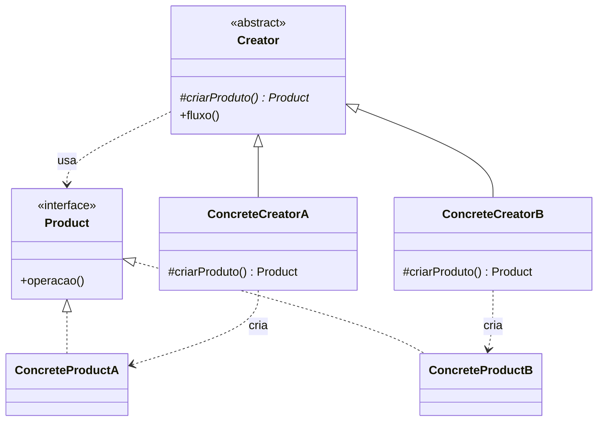

# Design Patterns em Java

Exercícios de estudo de padrões de projeto criacionais do catálogo GoF, feitos para a disciplina de Design Patterns.

Resumo para consulta na prova: [COLA.md](COLA.md). Modelos em código com diagramas UML: [modelosProva/](modelosProva/).

## Padrões

### Factory Method

> Define uma interface para criar um objeto, mas deixa as **subclasses** decidirem qual classe instanciar.

| Pasta | Exercício | Produto criado |
|---|---|---|
| [`factoryMethod/`](factoryMethod/) | Sistema de notificações | `Notificacao` (Email, SMS, Push) |
| [`factoryMethodV2/`](factoryMethodV2/) | Logística de entregas | `Transporte` (Caminhão, Navio, Avião) |
| [`factoryMethoudV3/`](factoryMethoudV3/) | Pagamentos de loja online | `MetodoPagamento` (Pix, Cartão, Boleto) |

### Abstract Factory

Em andamento.

## Estrutura do Factory Method

Os três exercícios seguem os mesmos papéis:

| Papel | Responsabilidade | Em Java |
|---|---|---|
| **Product** | Contrato do objeto que será criado | `interface` |
| **ConcreteProduct** | Implementações reais do produto | `class ... implements Product` |
| **Creator** | Declara o método fábrica e contém o fluxo comum que usa o produto | `abstract class` |
| **ConcreteCreator** | Sobrescreve o método fábrica e decide qual produto criar | `class ... extends Creator` |
| **Client** | Usa o Creator sem conhecer os produtos concretos | `Main` |



### Regras aplicadas

1. O **cliente nunca instancia um produto concreto**, só criadores concretos.
2. O **Creator não tem nenhum `new`**. Quem cria o produto é a subclasse.
3. As subclasses **sobrescrevem apenas o método fábrica**. O fluxo fica no Creator.
4. As variáveis usam **tipos abstratos** (`Logistica`, `Transporte`), e não as classes concretas.

### Por que usar

- **Princípio Aberto/Fechado (SOLID):** um novo produto (ex.: WhatsApp, Drone, PayPal) entra com **duas classes novas**, um produto e um criador, sem alterar nenhuma classe existente.
- **Baixo acoplamento:** o cliente depende só de abstrações.

### Factory Method × Simple Factory

Uma classe com `switch(tipo)` que retorna `new X()` é uma **Simple Factory**. Ela não é um padrão GoF e viola o Aberto/Fechado, porque cada produto novo exige editar o `switch`. O Factory Method usa **herança**: cada subclasse decide o produto.

## Como executar

É preciso ter um JDK instalado. Na raiz do repositório:

```bash
javac factoryMethod/*.java
java factoryMethod.Main
```

Troque `factoryMethod` pelo nome da pasta do exercício que quiser rodar. No VS Code, também dá para usar o botão ▶ acima do método `main`.
