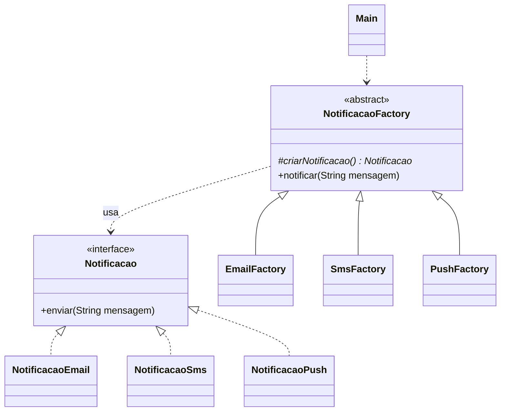

# Exercício 1: Sistema de Notificações

**Padrão:** Factory Method

## Enunciado

### Contexto de negócio

Uma rede de varejo envia avisos aos clientes (confirmação de pedido, promoções, alertas de entrega). Hoje a rotina de envio escolhe o canal por uma sequência de `if/else` que cresce a cada canal novo, e cada alteração já causou falhas nos canais que funcionavam. A área de produto definiu três canais para o lançamento, **E-mail**, **SMS** e **Push**, e já estuda incluir **WhatsApp** no próximo trimestre.

### Especificação funcional

- **RF01 (E-mail):** a notificação é enviada por e-mail (simulado por uma mensagem no console).
- **RF02 (SMS):** a notificação é enviada por SMS (simulado por uma mensagem no console).
- **RF03 (Push):** a notificação é enviada por push no aplicativo (simulado por uma mensagem no console).
- **RF04:** todo envio segue o mesmo fluxo, qualquer que seja o canal: criar a notificação, enviar a mensagem e registrar no console a confirmação "Notificação enviada com sucesso".

### Requisitos não funcionais

- **RNF01:** a inclusão de um novo canal não pode exigir alteração de nenhuma classe existente, apenas a adição de classes novas (princípio aberto/fechado).
- **RNF02:** a classe cliente não pode instanciar diretamente nenhuma classe concreta de notificação.

### Tarefa

Implemente o sistema usando o padrão **Factory Method** (GoF), com:

- uma interface de produto que declare o método de envio, com uma classe concreta por canal;
- uma classe abstrata criadora que declare o método fábrica (abstrato) e um método concreto que execute o fluxo do RF04 usando apenas a abstração do produto;
- uma subclasse criadora concreta por canal, sobrescrevendo o método fábrica;
- uma classe cliente (`Main`) que use apenas os criadores.

### Entregáveis

- diagrama de classes UML;
- código Java compilável, com um `main` que envie uma notificação por cada canal.

### Critérios de avaliação

- método fábrica isolado nas subclasses e fluxo de envio centralizado na superclasse;
- ausência de `if/switch` decidindo o canal no cliente ou na superclasse;
- aderência do diagrama ao código.

### Leitura do enunciado

| Trecho | Decisão no código |
|---|---|
| "`if/else` que cresce a cada canal novo" | trocar o `if` por polimorfismo |
| "E-mail, SMS, Push" | três produtos concretos: `NotificacaoEmail`, `NotificacaoSms`, `NotificacaoPush` |
| "todo envio segue o mesmo fluxo" (RF04) | método concreto `notificar()` na classe abstrata `NotificacaoFactory` |
| "sem alterar nenhuma classe existente" (RNF01) | WhatsApp entra com duas classes novas (seção abaixo) |
| "cliente não pode instanciar ... concreta" (RNF02) | `Main` só faz `new SmsFactory()`, nunca `new NotificacaoSms()` |

## Papéis

| Papel | Classe |
|---|---|
| Product | `Notificacao` (interface: `enviar(String mensagem)`) |
| ConcreteProduct | `NotificacaoEmail`, `NotificacaoSms`, `NotificacaoPush` |
| Creator | `NotificacaoFactory` (abstrata: `criarNotificacao()` + `notificar(String mensagem)`) |
| ConcreteCreator | `EmailFactory`, `SmsFactory`, `PushFactory` |
| Client | `Main` |



## Como funciona

O `notificar()` fica na classe abstrata e é igual para todos os canais:

```java
public void notificar(String mensagem) {
    Notificacao notificacao = criarNotificacao(); // a subclasse decide qual
    notificacao.enviar(mensagem);
    // log
}
```

Cada factory concreta só diz qual notificação criar:

```java
public class SmsFactory extends NotificacaoFactory {
    @Override
    protected Notificacao criarNotificacao() {
        return new NotificacaoSms();
    }
}
```

## Como adicionar WhatsApp

1. Criar `NotificacaoWhatsApp implements Notificacao`
2. Criar `WhatsAppFactory extends NotificacaoFactory`, retornando `new NotificacaoWhatsApp()`
3. Usar no `Main`: `new WhatsAppFactory().notificar("...")`

Nenhuma classe existente precisa ser alterada.

## Executar

```bash
javac factoryMethod/*.java
java factoryMethod.Main
```
