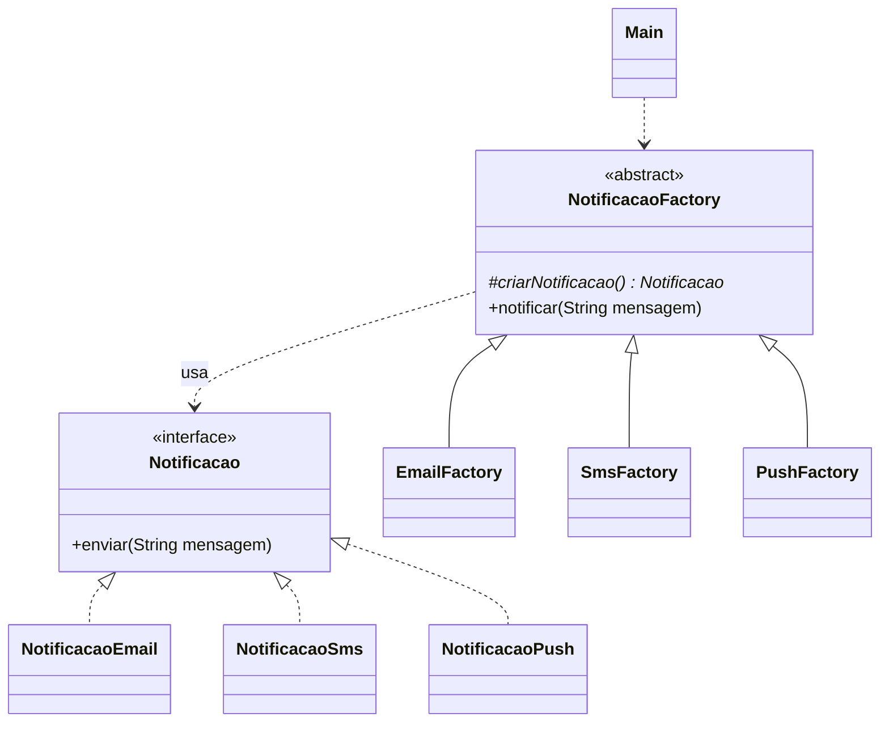

# Exercício 1: Sistema de Notificações

**Padrão:** Factory Method

## Enunciado

Uma empresa precisa enviar notificações aos clientes por **E-mail**, **SMS** e **Push**. Todo envio segue o mesmo fluxo: criar a notificação, enviar e registrar log. O que muda é só o *tipo* de notificação criada.

Deve ser possível adicionar um novo canal (ex.: WhatsApp) **sem alterar** as classes existentes.

## Papéis

| Papel | Classe |
|---|---|
| Product | `Notificacao` (interface: `enviar(String mensagem)`) |
| ConcreteProduct | `NotificacaoEmail`, `NotificacaoSms`, `NotificacaoPush` |
| Creator | `NotificacaoFactory` (abstrata: `criarNotificacao()` + `notificar(String mensagem)`) |
| ConcreteCreator | `EmailFactory`, `SmsFactory`, `PushFactory` |
| Client | `Main` |



## Como funciona

O `notificar()` fica na classe abstrata e é igual para todos os canais:

```java
public void notificar(String mensagem) {
    Notificacao notificacao = criarNotificacao(); // a subclasse decide qual
    notificacao.enviar(mensagem);
    // log
}
```

Cada factory concreta só diz qual notificação criar:

```java
public class SmsFactory extends NotificacaoFactory {
    @Override
    protected Notificacao criarNotificacao() {
        return new NotificacaoSms();
    }
}
```

## Como adicionar WhatsApp

1. Criar `NotificacaoWhatsApp implements Notificacao`
2. Criar `WhatsAppFactory extends NotificacaoFactory`, retornando `new NotificacaoWhatsApp()`
3. Usar no `Main`: `new WhatsAppFactory().notificar("...")`

Nenhuma classe existente precisa ser alterada.

## Executar

```bash
javac factoryMethod/*.java
java factoryMethod.Main
```
