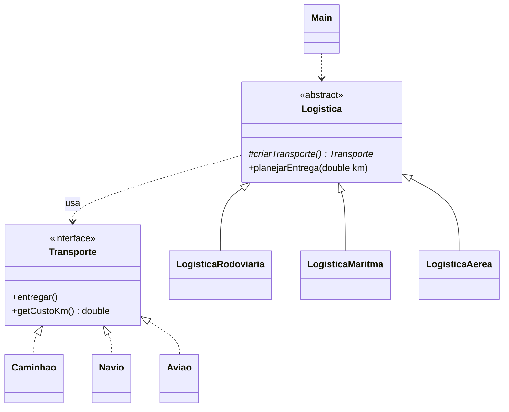

# Exercício 2: Logística de Entregas

**Padrão:** Factory Method

## Enunciado

### Contexto de negócio

Uma transportadora opera entregas por via **rodoviária**, **marítima** e **aérea**. O planejamento de entregas foi escrito quando a empresa só tinha caminhões, e cada modal novo foi encaixado com mais um `if` na mesma classe. A diretoria de operações já aprovou um piloto com **drones** e exigiu que a entrada do novo modal não mexa no código que está em produção.

### Especificação funcional

- **RF01 (Rodoviária):** a entrega é feita por caminhão, com custo de **R$ 0,30 por km**.
- **RF02 (Marítima):** a entrega é feita por navio, com custo de **R$ 0,50 por km**.
- **RF03 (Aérea):** a entrega é feita por avião, com custo de **R$ 1,00 por km**.
- **RF04:** todo planejamento de entrega segue o mesmo processo: obter o transporte, realizar a entrega (mensagem no console) e imprimir o custo total, calculado por `distância (km) × custo por km do transporte`. A distância é informada a cada entrega.

### Requisitos não funcionais

- **RNF01:** novos modais devem poder ser adicionados sem alteração de nenhuma classe existente.
- **RNF02:** o custo por km é responsabilidade de cada transporte; a classe que planeja a entrega não pode conhecer valores de custo.

### Tarefa

Implemente o sistema usando o padrão **Factory Method** (GoF), com:

- uma interface de produto (`Transporte`) com os métodos de entrega e de custo por km, e uma classe concreta por modal;
- uma classe abstrata criadora (`Logistica`) com o método fábrica abstrato e um método concreto que execute o RF04;
- uma subclasse criadora por modal;
- uma classe cliente que planeje ao menos uma entrega por modal.

### Entregáveis

- diagrama de classes UML;
- código Java compilável, com um `main` que planeje uma entrega de 5 km em cada modal e imprima os custos.

### Critérios de avaliação

- método fábrica isolado nas subclasses e cálculo do custo centralizado na superclasse;
- valores de custo por km implementados apenas nos produtos (RNF02);
- ausência de `if/switch` decidindo o modal.

### Leitura do enunciado

| Trecho | Decisão no código |
|---|---|
| "caminhão, navio, avião" | produtos concretos `Caminhao`, `Navio`, `Aviao` |
| "custo por km" diferente por modal (RF01 a RF03) | método `getCustoKm()` na interface, cada produto retorna seu valor |
| "mesmo processo" (RF04) | método concreto `planejarEntrega(double km)` em `Logistica` |
| "distância é informada a cada entrega" | `km` vira **parâmetro** do método, não atributo |
| "não pode conhecer valores de custo" (RNF02) | `Logistica` só chama `transporte.getCustoKm()`, sem números fixos |

## Papéis

| Papel | Classe |
|---|---|
| Product | `Transporte` (interface: `entregar()`, `getCustoKm()`) |
| ConcreteProduct | `Caminhao`, `Navio`, `Aviao` |
| Creator | `Logistica` (abstrata: `criarTransporte()` + `planejarEntrega(double km)`) |
| ConcreteCreator | `LogisticaRodoviaria`, `LogisticaMaritma`, `LogisticaAerea` |
| Client | `Main` |



## Como funciona

As informações vêm de lugares diferentes:

| Informação | Onde fica | Varia? |
|---|---|---|
| Custo por km | no **produto** (`getCustoKm()` retorna um valor fixo) | não, é fixo por transporte |
| Distância | **parâmetro** de `planejarEntrega(double km)`, passado pelo `Main` | sim, muda a cada entrega |

```java
public void planejarEntrega(double km) {
    Transporte transporte = criarTransporte(); // criado uma única vez
    transporte.entregar();
    double total = km * transporte.getCustoKm();
    System.out.println("Custo: " + total);
}
```

No cliente:

```java
Logistica logistica = new LogisticaAerea();
logistica.planejarEntrega(5);
```

O `Main` nunca faz `new Aviao()`. Quem sabe qual transporte usar é a `LogisticaAerea`.

## Executar

```bash
javac factoryMethodV2/*.java
java factoryMethodV2.Main
```
