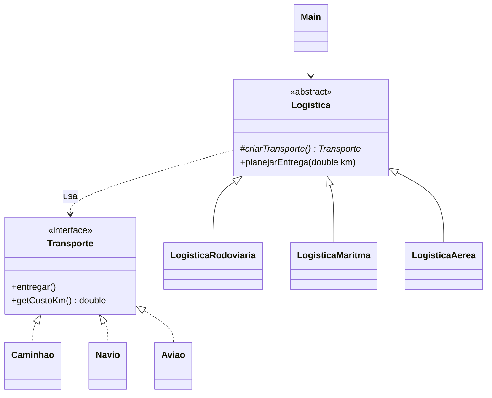

# Exercício 2: Logística de Entregas

**Padrão:** Factory Method

## Enunciado

Uma empresa de logística faz entregas por **Caminhão**, **Navio** e **Avião**. Todo pedido segue o mesmo processo: entregar e calcular o custo. O que muda é o transporte usado.

Cada transporte informa o **próprio custo por km**, e o sistema calcula o custo total: `distância × custo por km`.

Deve ser possível adicionar um **Drone** sem alterar as classes existentes.

## Papéis

| Papel | Classe |
|---|---|
| Product | `Transporte` (interface: `entregar()`, `getCustoKm()`) |
| ConcreteProduct | `Caminhao`, `Navio`, `Aviao` |
| Creator | `Logistica` (abstrata: `criarTransporte()` + `planejarEntrega(double km)`) |
| ConcreteCreator | `LogisticaRodoviaria`, `LogisticaMaritma`, `LogisticaAerea` |
| Client | `Main` |



## Como funciona

As informações vêm de lugares diferentes:

| Informação | Onde fica | Varia? |
|---|---|---|
| Custo por km | no **produto** (`getCustoKm()` retorna um valor fixo) | não, é fixo por transporte |
| Distância | **parâmetro** de `planejarEntrega(double km)`, passado pelo `Main` | sim, muda a cada entrega |

```java
public void planejarEntrega(double km) {
    Transporte transporte = criarTransporte(); // criado uma única vez
    transporte.entregar();
    double total = km * transporte.getCustoKm();
    System.out.println("Custo: " + total);
}
```

No cliente:

```java
Logistica logistica = new LogisticaAerea();
logistica.planejarEntrega(5);
```

O `Main` nunca faz `new Aviao()`. Quem sabe qual transporte usar é a `LogisticaAerea`.

## Executar

```bash
javac factoryMethodV2/*.java
java factoryMethodV2.Main
```
