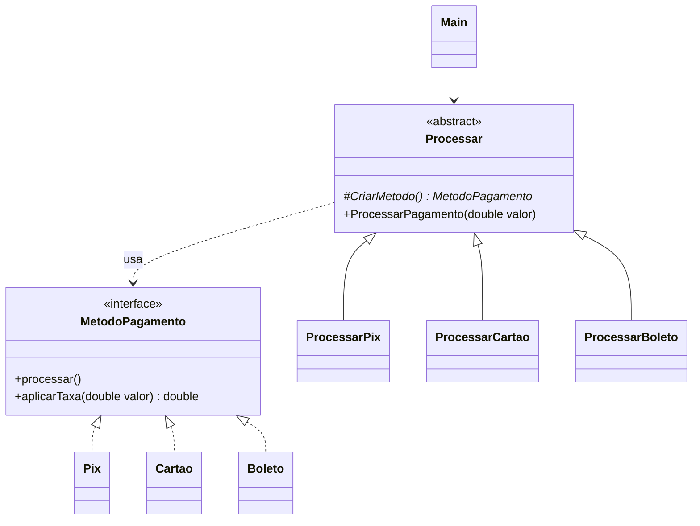

# Exercício 3: Pagamentos de Loja Online

**Padrão:** Factory Method

## Enunciado

### Contexto de negócio

Uma loja online de eletrônicos concentra todo o pagamento em uma única classe que, por meio de um `switch`, decide como cobrar e qual taxa aplicar. Uma mudança recente na taxa do cartão quebrou o cálculo do boleto, e o time financeiro passou a exigir que cada forma de pagamento seja isolada. O comercial já negocia a entrada do **PayPal**.

### Especificação funcional

- **RF01 (Pix):** o pagamento é processado via Pix, sem taxa. Valor final = `valor`.
- **RF02 (Cartão de crédito):** o pagamento é processado no cartão, com taxa de **5%**. Valor final = `valor × 1,05`.
- **RF03 (Boleto):** o pagamento é processado por boleto, com tarifa fixa de **R$ 3,00**. Valor final = `valor + 3`.
- **RF04:** toda compra segue o mesmo processo, qualquer que seja a forma de pagamento:
  1. **validar** o valor: se for menor ou igual a zero, a compra é recusada, uma mensagem é exibida e o processo é encerrado;
  2. **processar** o pagamento;
  3. **imprimir o recibo** com o valor final já com a taxa.

### Requisitos não funcionais

- **RNF01:** novas formas de pagamento devem poder ser adicionadas sem alteração de nenhuma classe existente.
- **RNF02:** a regra de validação do valor deve existir em **um único lugar**, valendo para todas as formas de pagamento.

### Tarefa

Implemente o sistema usando o padrão **Factory Method** (GoF), com:

- uma interface de produto (`MetodoPagamento`) com os métodos de processamento e de cálculo de taxa, e uma classe concreta por forma de pagamento;
- uma classe abstrata criadora com o método fábrica abstrato e um método concreto que execute o RF04;
- uma subclasse criadora por forma de pagamento;
- uma classe cliente que processe uma compra em cada forma de pagamento.

### Entregáveis

- diagrama de classes UML;
- código Java compilável, com um `main` que processe uma compra de R$ 50,00 em cada forma de pagamento.

### Critérios de avaliação

- validação e recibo centralizados na superclasse; taxa e processamento nos produtos;
- implementação fiel das taxas de RF01 a RF03 e da recusa do RF04;
- ausência de `if/switch` decidindo a forma de pagamento.

### Leitura do enunciado

| Trecho | Decisão no código |
|---|---|
| "um `switch` decide como cobrar" | trocar o `switch` por polimorfismo |
| taxas diferentes (RF01 a RF03) | `aplicarTaxa(double valor)` na interface, uma fórmula em cada produto |
| "validar ... encerrar o processo" (RF04) | `if (valor <= 0) { ...; return; }` no início de `ProcessarPagamento` |
| "validação em um único lugar" (RNF02) | o `if` fica no Creator, nunca repetido nos produtos |
| "entrada do PayPal" (RNF01) | `PayPal implements MetodoPagamento` + `ProcessarPayPal extends Processar` |

## Papéis

| Papel | Classe |
|---|---|
| Product | `MetodoPagamento` (interface: `processar()`, `aplicarTaxa(double valor)`) |
| ConcreteProduct | `Pix`, `Cartao`, `Boleto` |
| Creator | `Processar` (abstrata: `CriarMetodo()` + `ProcessarPagamento(double valor)`) |
| ConcreteCreator | `ProcessarPix`, `ProcessarCartao`, `ProcessarBoleto` |
| Client | `Main` |



## Como funciona

A divisão de responsabilidades segue uma pergunta: **"isso muda de uma forma de pagamento para outra?"**

| Passo | Muda? | Onde fica |
|---|---|---|
| Validar valor | não | Creator (`Processar`) |
| Processar pagamento | sim | Produto |
| Calcular taxa | sim | Produto |
| Imprimir recibo | não | Creator (`Processar`) |

```java
public void ProcessarPagamento(double valor) {
    if (valor <= 0) {
        System.out.println("O valor não pode ser menor que 0");
        return; // encerra o fluxo
    }
    MetodoPagamento metodoPagamento = CriarMetodo();
    metodoPagamento.processar();
    double valorFinal = metodoPagamento.aplicarTaxa(valor);
    System.out.println("Recibo: valor pago R$ " + valorFinal);
}
```

## Executar

```bash
javac factoryMethoudV3/*.java
java factoryMethoudV3.Main
```
