# Exercício 3: Pagamentos de Loja Online

**Padrão:** Factory Method

## Enunciado

Uma loja online aceita pagamento por **Pix**, **Cartão de Crédito** e **Boleto**. Toda compra segue o mesmo processo:

1. **Validar** o valor. Se for menor ou igual a zero, a compra é recusada e o processo para.
2. **Processar** o pagamento.
3. **Imprimir o recibo** com o valor final.

Cada forma de pagamento tem uma taxa diferente:

| Pagamento | Taxa | Cálculo |
|---|---|---|
| Pix | 0% | `valor` |
| Cartão | 5% | `valor * 1.05` |
| Boleto | R$ 3,00 fixo | `valor + 3` |

Deve ser possível adicionar **PayPal** sem alterar as classes existentes.

## Papéis

| Papel | Classe |
|---|---|
| Product | `MetodoPagamento` (interface: `processar()`, `aplicarTaxa(double valor)`) |
| ConcreteProduct | `Pix`, `Cartao`, `Boleto` |
| Creator | `Processar` (abstrata: `CriarMetodo()` + `ProcessarPagamento(double valor)`) |
| ConcreteCreator | `ProcessarPix`, `ProcessarCartao`, `ProcessarBoleto` |
| Client | `Main` |

```mermaid
classDiagram
    class MetodoPagamento {
        <<interface>>
        +processar()
        +aplicarTaxa(double valor) double
    }
    class Pix
    class Cartao
    class Boleto

    class Processar {
        <<abstract>>
        #CriarMetodo()* MetodoPagamento
        +ProcessarPagamento(double valor)
    }
    class ProcessarPix
    class ProcessarCartao
    class ProcessarBoleto

    MetodoPagamento <|.. Pix
    MetodoPagamento <|.. Cartao
    MetodoPagamento <|.. Boleto
    Processar <|-- ProcessarPix
    Processar <|-- ProcessarCartao
    Processar <|-- ProcessarBoleto
    Processar ..> MetodoPagamento : usa
    Main ..> Processar
```



## Como funciona

A divisão de responsabilidades segue uma pergunta: **"isso muda de uma forma de pagamento para outra?"**

| Passo | Muda? | Onde fica |
|---|---|---|
| Validar valor | não | Creator (`Processar`) |
| Processar pagamento | sim | Produto |
| Calcular taxa | sim | Produto |
| Imprimir recibo | não | Creator (`Processar`) |

```java
public void ProcessarPagamento(double valor) {
    if (valor <= 0) {
        System.out.println("O valor não pode ser menor que 0");
        return; // encerra o fluxo
    }
    MetodoPagamento metodoPagamento = CriarMetodo();
    metodoPagamento.processar();
    double valorFinal = metodoPagamento.aplicarTaxa(valor);
    System.out.println("Recibo: valor pago R$ " + valorFinal);
}
```

## Executar

```bash
javac factoryMethoudV3/*.java
java factoryMethoudV3.Main
```
