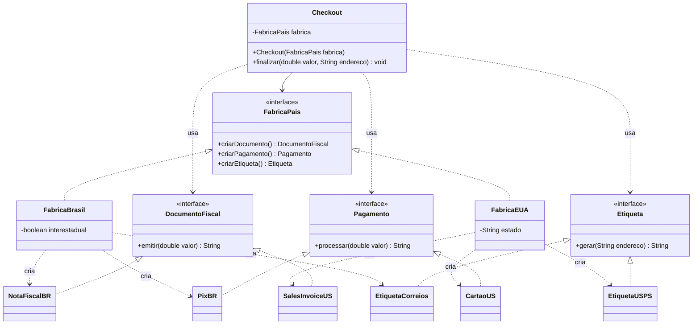

# Abstract Factory: modelo

| Papel | Classe |
|---|---|
| AbstractFactory | `FabricaPais` (interface: `criarDocumento()`, `criarPagamento()`, `criarEtiqueta()`) |
| ConcreteFactory | `FabricaBrasil`, `FabricaEUA` |
| AbstractProduct | `DocumentoFiscal`, `Pagamento`, `Etiqueta` |
| ConcreteProduct | `NotaFiscalBR`, `PixBR`, `EtiquetaCorreios` / `SalesInvoiceUS`, `CartaoUS`, `EtiquetaUSPS` |
| Client | `Checkout` (recebe a fábrica pelo construtor) e `Main` |

## UML (mermaid)



## UML (texto)

```
   ┌──────────────────────────┐         ┌─────────────────────────────────┐
   │         Checkout         │────────>│          <<interface>>          │
   ├──────────────────────────┤  tem    │           FabricaPais           │
   │ - fabrica: FabricaPais   │         ├─────────────────────────────────┤
   ├──────────────────────────┤         │ + criarDocumento(): DocumentoF. │
   │ + finalizar(valor, end.) │         │ + criarPagamento(): Pagamento   │
   └──────────────────────────┘         │ + criarEtiqueta(): Etiqueta     │
                                        └───────────────▲─────────────────┘
                                                        ¦ (implements)
                                     ┌ - - - - - - - - -┴- - - - - - - - -┐
                             ┌───────┴───────┐                    ┌───────┴───────┐
                             │ FabricaBrasil │                    │  FabricaEUA   │
                             └───────┬───────┘                    └───────┬───────┘
                                     ¦ cria                               ¦ cria
             ┌ - - - - - - - - - - - ┼ - - - - - - - ┐    ┌ - - - - - - - ┼ - - - - - - - ┐
             ▼                       ▼               ▼    ▼               ▼               ▼
      NotaFiscalBR               PixBR     EtiquetaCorreios  SalesInvoiceUS  CartaoUS  EtiquetaUSPS
             ¦                       ¦               ¦    ¦               ¦               ¦
             ▽                       ▽               ▽    ▽               ▽               ▽
   <<interface>> DocumentoFiscal   <<interface>> Pagamento   <<interface>> Etiqueta
   (NotaFiscalBR, SalesInvoiceUS)  (PixBR, CartaoUS)         (EtiquetaCorreios, EtiquetaUSPS)
```

Leitura: cada **coluna** é um tipo de produto (documento, pagamento, etiqueta) e cada **fábrica** é uma linha/família (Brasil, EUA). O `Checkout` só enxerga as interfaces.

## Observações

- **Por que não dá para misturar países:** o `Checkout` recebe **uma** fábrica, e a `FabricaBrasil` só sabe criar produtos brasileiros.
- **Novo país (Alemanha):** `FabricaAlemanha` + `VatInvoiceDE`, `SepaDE`, `EtiquetaDeutschePost`. Nenhuma classe existente muda.
