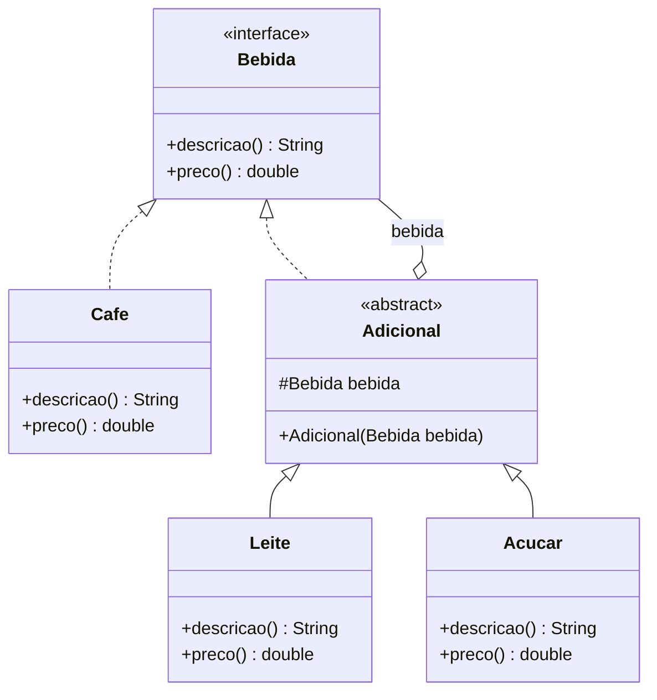

# Decorator: modelo

| Papel | Classe |
|---|---|
| Component | `Bebida` (interface: `descricao()`, `preco()`) |
| ConcreteComponent | `Cafe` |
| Decorator | `Adicional` (abstrata: implementa `Bebida` e guarda uma `Bebida`) |
| ConcreteDecorator | `Leite`, `Acucar` |
| Client | `Main` |

## UML (mermaid)



## UML (texto)

```
                    ┌──────────────────────┐
                    │    <<interface>>     │
                    │        Bebida        │ ◁─────────────────┐
                    ├──────────────────────┤                   │
                    │ + descricao(): String│                   │ tem 1 (bebida)
                    │ + preco(): double    │                   │
                    └──────────▲───────────┘                   │
                               ¦ (implements)                  │
                 ┌ - - - - - - ┴ - - - - - - ┐                 │
          ┌──────┴──────┐         ┌──────────┴──────────┐      │
          │    Cafe     │         │    <<abstract>>     │◇─────┘
          └─────────────┘         │      Adicional      │
                                  ├─────────────────────┤
                                  │ # bebida: Bebida    │
                                  └──────────▲──────────┘
                                             │ (extends)
                                  ┌──────────┴──────────┐
                           ┌──────┴──────┐       ┌──────┴──────┐
                           │    Leite    │       │   Acucar    │
                           └─────────────┘       └─────────────┘
```

Montagem: `new Acucar(new Leite(new Cafe()))` → `preco()` = 3.0 + 0.5 + 0.1.

## Observações

- O ponto-chave do diagrama: `Adicional` **é** uma `Bebida` (implementa) **e tem** uma `Bebida` (atributo). As duas setas precisam aparecer.
