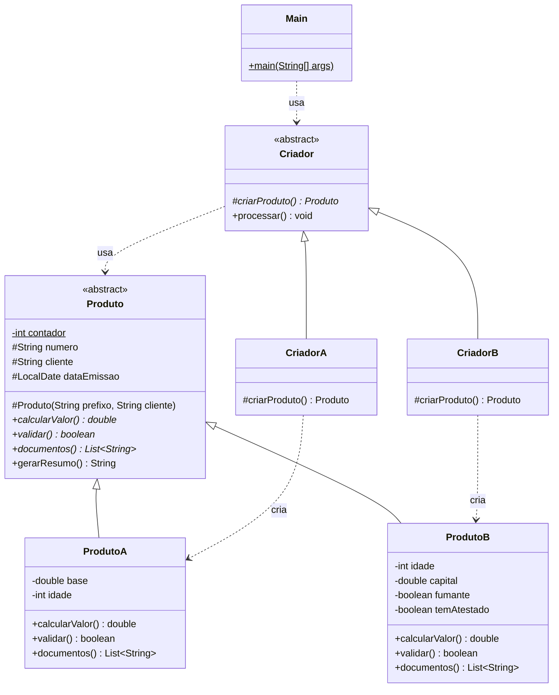

# Factory Method: modelo

| Papel | Classe |
|---|---|
| Product | `Produto` (abstrata: atributos comuns, `gerarResumo()` concreto) |
| ConcreteProduct | `ProdutoA`, `ProdutoB` |
| Creator | `Criador` (abstrata: `criarProduto()` abstrato + `processar()` final) |
| ConcreteCreator | `CriadorA`, `CriadorB` |
| Client | `Main` |

## UML (mermaid)



## UML (texto)

```
                 ┌──────────────────────────────┐
                 │        <<abstract>>          │
                 │           Criador            │
                 ├──────────────────────────────┤
                 │ # criarProduto(): Produto    │  (abstrato)
                 │ + processar(): void  {final} │
                 └──────────────▲───────────────┘
      Main - - - - - - - - - - -│- - - - - - - - - - - - usa
                    ┌───────────┴────────────┐
             ┌──────┴───────┐         ┌──────┴───────┐
             │   CriadorA   │         │   CriadorB   │
             ├──────────────┤         ├──────────────┤
             │# criarProduto│         │# criarProduto│
             └──────┬───────┘         └──────┬───────┘
                    ¦ cria                   ¦ cria
                    ▼                        ▼
             ┌──────────────┐         ┌──────────────┐
             │   ProdutoA   │         │   ProdutoB   │
             └──────┬───────┘         └──────┬───────┘
                    └───────────┬────────────┘
                                ▽ (extends)
                 ┌──────────────────────────────┐
                 │        <<abstract>>          │
                 │           Produto            │
                 ├──────────────────────────────┤
                 │ - contador: int  {static}    │
                 │ # numero: String             │
                 │ # cliente: String            │
                 │ # dataEmissao: LocalDate     │
                 ├──────────────────────────────┤
                 │ + calcularValor(): double    │  (abstrato)
                 │ + validar(): boolean         │  (abstrato)
                 │ + documentos(): List<String> │  (abstrato)
                 │ + gerarResumo(): String      │
                 └──────────────────────────────┘
```

## Observações

- Se o enunciado pedir **interface** de produto em vez de classe abstrata, troque `Produto <|-- ProdutoA` por `Produto <|.. ProdutoA` (tracejado) e `extends` por `implements`.
- O contador conta toda criação, inclusive as rejeitadas (por isso a saída pula de B-0002 para B-0005). Se o enunciado exigir número só para as aprovadas, gere o número no `processar()` depois do `validar()`.
