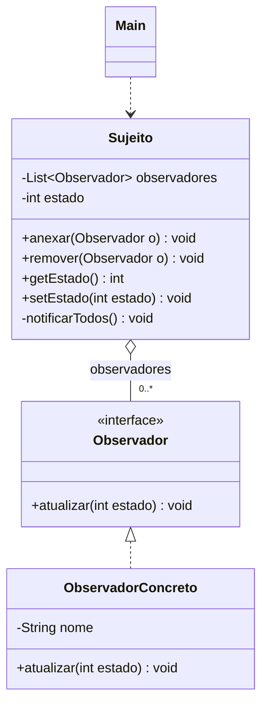

# Observer: modelo

| Papel | Classe |
|---|---|
| Subject | `Sujeito` (lista de observadores, `anexar()`, `setEstado()` avisa todos) |
| Observer | `Observador` (interface: `atualizar(int estado)`) |
| ConcreteObserver | `ObservadorConcreto` |
| Client | `Main` |

## UML (mermaid)



## UML (texto)

```
   ┌──────────────────────────────┐            ┌─────────────────────────┐
   │           Sujeito            │ ◇────────> │      <<interface>>      │
   ├──────────────────────────────┤  0..*      │       Observador        │
   │ - observadores: List<Obs.>   │            ├─────────────────────────┤
   │ - estado: int                │            │ + atualizar(estado)     │
   ├──────────────────────────────┤            └────────────▲────────────┘
   │ + anexar(o: Observador)      │                         ¦ (implements)
   │ + remover(o: Observador)     │            ┌────────────┴────────────┐
   │ + setEstado(estado: int)     │            │   ObservadorConcreto    │
   │ - notificarTodos()           │            ├─────────────────────────┤
   └──────────────────────────────┘            │ - nome: String          │
                                               │ + atualizar(estado)     │
                                               └─────────────────────────┘
```

Fluxo: `setEstado(10)` → `notificarTodos()` → `atualizar(10)` em cada observador da lista.

## Observações

- O losango vazio (`o--`) é **agregação**: o sujeito tem uma lista de observadores, mas eles existem sem ele.
- No slide do professor o `Observer` é classe abstrata com `protected Subject subject` e o observador se anexa no próprio construtor. As duas formas estão certas.
