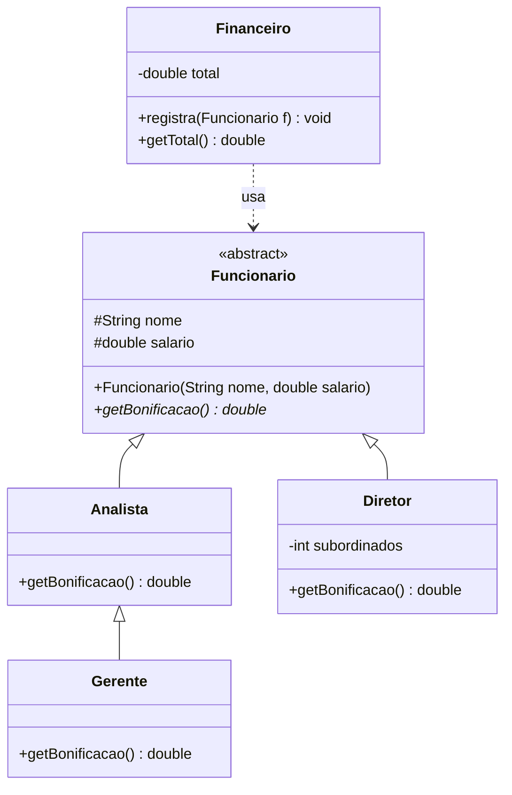

# Herança e polimorfismo: modelo

Baseado no exemplo dos slides (Funcionário, Gerente, Diretor, Financeiro).

| Conceito | Onde aparece |
|---|---|
| Classe abstrata | `Funcionario` não pode ser instanciado |
| Método abstrato | `getBonificacao()` sem corpo na base |
| `@Override` | cada subclasse implementa `getBonificacao()` |
| `super(...)` | construtores das subclasses chamam o da base |
| `super.metodo()` | `Gerente` reaproveita a bonificação do `Analista` e soma 1000 |
| Polimorfismo | `Financeiro.registra(Funcionario f)` aceita qualquer subclasse |

## UML (mermaid)



## UML (texto)

```
   ┌───────────────────────────┐          ┌───────────────────────────────┐
   │        Financeiro         │ - - - -> │         <<abstract>>          │
   ├───────────────────────────┤   usa    │          Funcionario          │
   │ - total: double           │          ├───────────────────────────────┤
   ├───────────────────────────┤          │ # nome: String                │
   │ + registra(f: Funcionario)│          │ # salario: double             │
   │ + getTotal(): double      │          ├───────────────────────────────┤
   └───────────────────────────┘          │ + getBonificacao(): double    │ (abstrato)
                                          └───────────────▲───────────────┘
                                                          │ (extends)
                                         ┌────────────────┴───────────────┐
                                  ┌──────┴───────┐                 ┌──────┴────────────┐
                                  │   Analista   │                 │      Diretor      │
                                  ├──────────────┤                 ├───────────────────┤
                                  │+getBonific.()│                 │ - subordinados:int│
                                  └──────▲───────┘                 │ + getBonific.()   │
                                         │ (extends)               └───────────────────┘
                                  ┌──────┴───────┐
                                  │   Gerente    │
                                  ├──────────────┤
                                  │+getBonific.()│  = super.getBonificacao() + 1000
                                  └──────────────┘
```

## Observações

- Nos exercícios dos slides (frete da Coisas & Coisas, disciplinas da UniLE) a estrutura é a mesma: classe base abstrata com o método que varia, subclasses com a regra própria, e uma classe que recebe a base e processa qualquer tipo.
